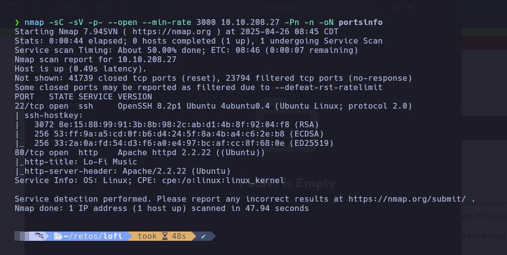
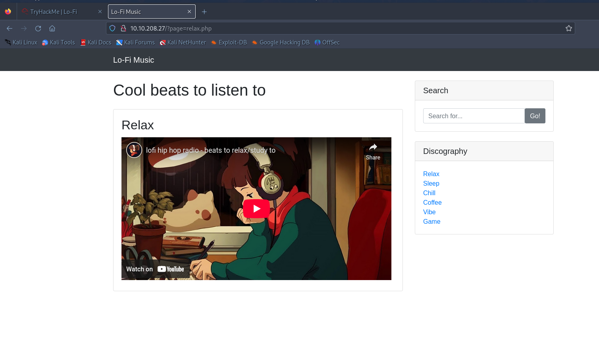
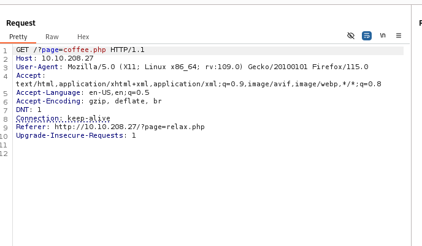
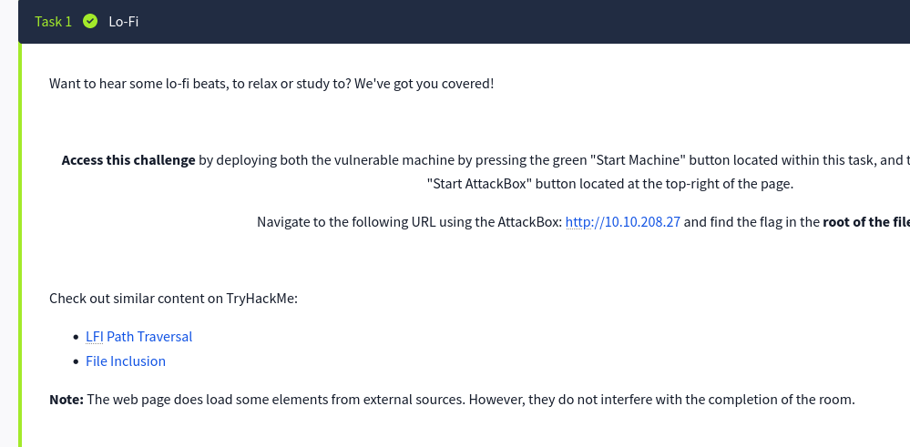
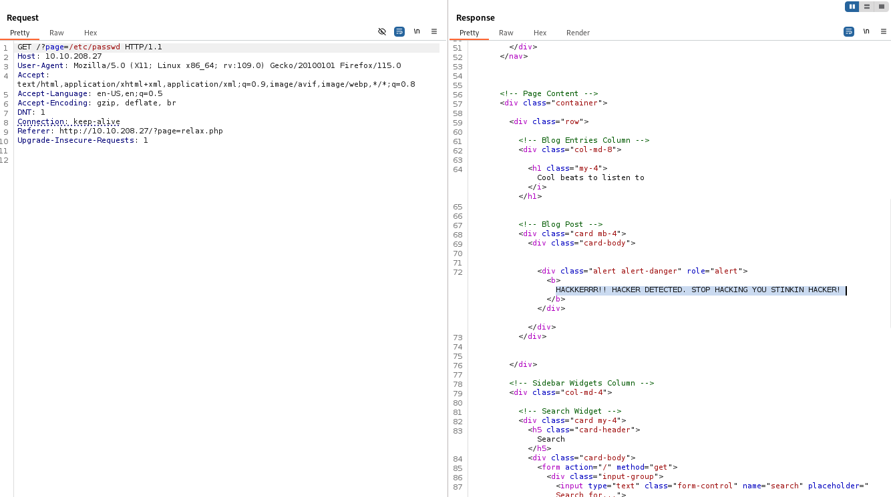
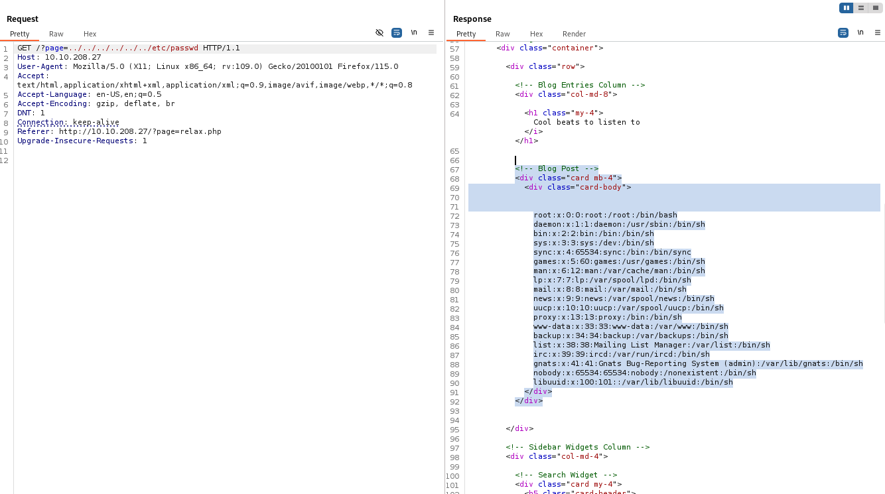
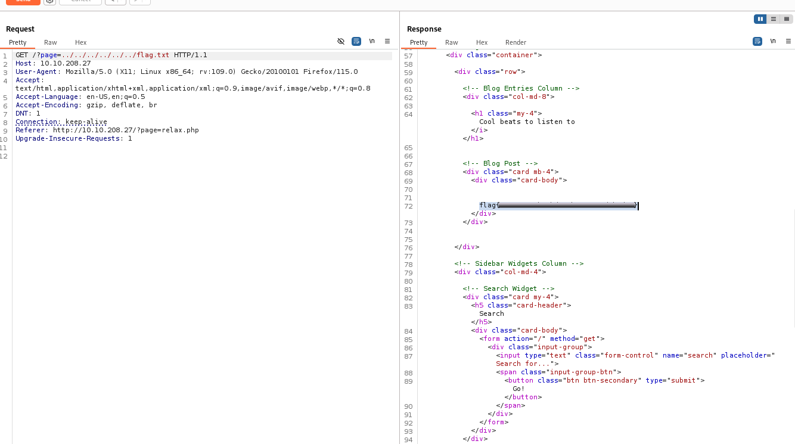

## 🔎 Enumeración

Comenzamos analizando la máquina con **nmap** para descubrir puertos abiertos y servicios activos.

 

 

Se observan dos puertos:

22/tcp SSH 80/tcp HTTP

 

Accedemos a la página web en el puerto 80 y encontramos un sitio sencillo que reproduce música Lo-Fi mediante vídeos de YouTube. Desde la sección **Discography** se puede cambiar entre distintas pistas.

 

 

Utilizando **Burp Suite** para interceptar las peticiones, vemos que el sitio realiza peticiones GET con un parámetro `page` para cambiar el contenido.

 

---

## 🚀 Explotación

La descripción del reto menciona una vulnerabilidad **LFI** (Local File Inclusion).

 

 

Empezamos intentando incluir un archivo clásico en ataques LFI: `/etc/passwd`, sustituyendo el valor de `page`:

 

 

Sin embargo, la aplicación responde con un error preconfigurado. Para intentar evadir el filtro, aplicamos un bypass utilizando `../` varias veces para forzar una lectura desde el sistema de archivos.

 

 

Esta vez conseguimos visualizar correctamente el contenido de `/etc/passwd`, lo que confirma la existencia de LFI.

Ya que el objetivo del reto es encontrar un archivo `flag.txt`, modificamos la carga para intentar acceder a `/flag.txt` directamente:

 

---

## 🎯 Conclusiones

**Lo-FI** es una máquina ideal para comenzar a practicar ataques de **Local File Inclusion** y **Path Traversal** de manera sencilla.

Permite comprender los conceptos básicos de explotación de archivos locales en aplicaciones web y cómo utilizar técnicas de bypass cuando existen filtros simples.

---